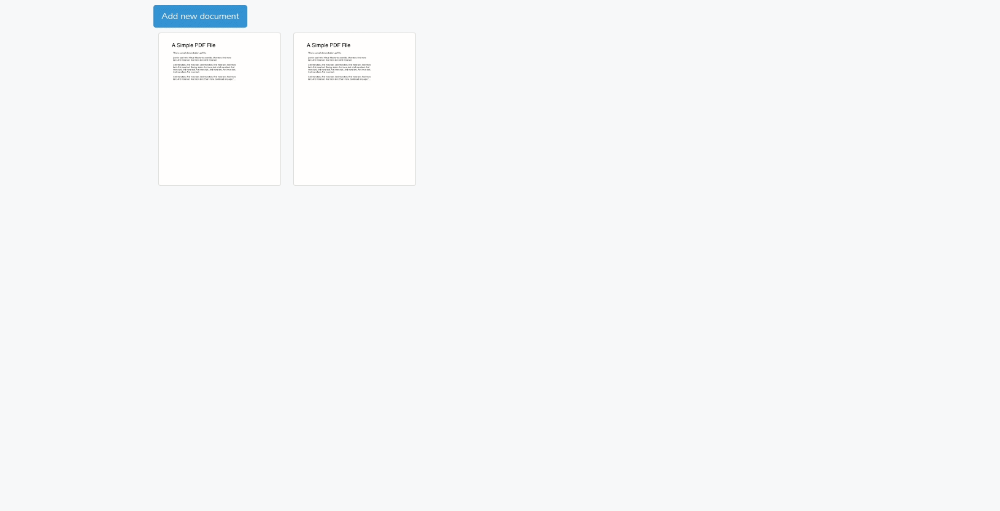

## PDF browser

You must create a new database with any name you would like.
Rename '.env.example' to '.env' and make sure to configure it with your mysql username, password and database name. If you are running from a different port make sure to update it in the "APP_URL" setting.

Afterwards run the following commands:

`composer update` This will install all the necessary dependencies

`php artisan migrate` This will create the neccesary tables for the project

`php artisan storage:link` This will create a link to the pdf files and their thumbnails so the site can access them

`php artisan serve` This will start the server

After that you can open https://localhost:8000 (or what you set as your APP_URL) in your favorite browser.

At first the site will be empty because of the lack of any files in the database. Start by adding your first pdf by clicking on "Add new document" button.

Within the project I have created two controllers, the first returns the main page
and the second stores a pdf file when it is uploaded through the new file form. The
second controller contains a private method which uses Ghostscript to create a thumbnail
from the pdf file and store it within the database.
